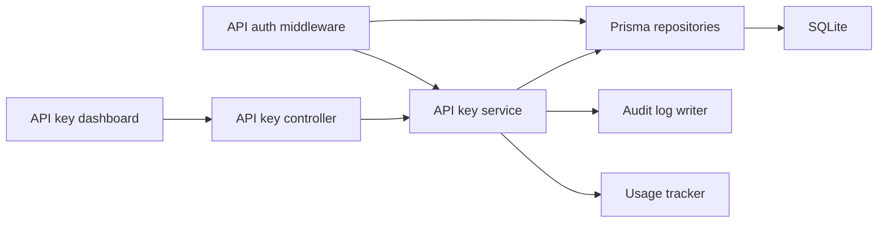

# Module: API Key Management Implementation Plan

## Scope
Implement workspace-scoped API key management across backend and frontend, covering:
- Create API key
- Rotate API key
- Revoke API key
- Delete API key
- Expiration
- Usage tracking
- Last used timestamp
- Workspace-scoped keys
- Key hashing
- Prefix generation
- Public and secret keys
- API authentication middleware
- Database schema
- Prisma models
- API endpoints
- Controllers
- Services
- Repositories
- DTOs
- Validation
- RBAC
- Swagger docs
- Dashboard pages
- API usage page
- Tests
- Audit logs

## Current State Summary
Exploration found the following baseline:
- [`backend/prisma/schema.prisma`](../backend/prisma/schema.prisma:1) already contains `ApiKey` and `ApiKeyUsage` models, plus the `ApiKeyType` and `ApiKeyStatus` enums, but the current shape is incomplete for the requested lifecycle and authentication behavior.
- [`backend/src/modules/api-keys/api-key.service.ts`](../backend/src/modules/api-keys/api-key.service.ts:1) already implements create, rotate, revoke, delete, usage tracking, and bearer-token lookup, but logic is still tightly coupled to Prisma and lacks a layered service/repository/controller structure.
- [`backend/src/modules/api-keys/api-keys.routes.ts`](../backend/src/modules/api-keys/api-keys.routes.ts:1) exposes the current endpoints directly from the router and performs validation/RBAC inline.
- [`backend/src/lib/auth.ts`](../backend/src/lib/auth.ts:1) already provides shared hashing and token utilities that can be reused or extended for API key authentication.
- Frontend surfaces already exist in [`app/(app)/dashboard/api-keys/page.tsx`](../app/(app)/dashboard/api-keys/page.tsx:1) and [`app/(app)/settings/page.tsx`](../app/(app)/settings/page.tsx:1), but both are static placeholder UIs.
- The backend app entrypoint in [`backend/src/app.ts`](../backend/src/app.ts:1) currently mounts the API keys router, but the module is not yet represented as a first-class documented subsystem in the API root response or Swagger flow.

## Product Decisions Locked In
- API keys are workspace-scoped and must never be queryable across workspaces.
- Public and secret keys are both supported, with distinct prefixes and hashing behavior.
- Plaintext secret material is returned only at creation and rotation time; subsequent reads return metadata only.
- Authentication middleware must resolve a key from bearer auth, enforce active status, reject expired or deleted keys, and track usage on successful or failed authenticated requests depending on the endpoint policy.
- Audit logs must be written for create, rotate, revoke, delete, and optionally usage-telemetry events if the audit model is already available.

## Proposed Architecture
### Backend
Refactor the current module into layered components:
- DTOs and validation schemas
- Repository layer for Prisma access
- Service layer for business rules and audit logging
- Controller layer for HTTP concerns
- Route layer for endpoint wiring
- Authentication middleware for API key resolution
- Shared utility functions for prefix generation, hash generation, and tracking
- Swagger/OpenAPI annotations or schema generation compatible with the existing backend style

### Frontend
Replace static placeholders with data-driven pages:
- API key index page for listing and lifecycle actions
- API key usage page for per-key and workspace-level telemetry
- Workspace-aware links from settings
- Confirmation and copy-to-clipboard affordances for newly created or rotated secret keys

## File-by-File Implementation Plan

### 1. Database schema and Prisma updates
Update [`backend/prisma/schema.prisma`](../backend/prisma/schema.prisma:1) to:
- Keep `ApiKeyType` values as `public` and `secret`
- Keep `ApiKeyStatus` values as `active`, `revoked`, and `deleted`
- Add or tighten indexes for:
  - `workspaceId + status`
  - `workspaceId + createdAt`
  - `workspaceId + prefix`
  - `workspaceId + deletedAt`
  - `apiKeyId + createdAt` in usage records
- Ensure `ApiKey` contains the fields needed for the lifecycle contract:
  - `workspaceId`
  - `name`
  - `prefix`
  - `keyHash`
  - `type`
  - `status`
  - `scopesJson`
  - `lastUsedAt`
  - `expiresAt`
  - `revokedAt`
  - `revokedReason`
  - `deletedAt`
  - `usageCount`
  - `createdById`
  - `updatedById`
- Ensure `ApiKeyUsage` stores the request telemetry needed for the usage page and audit trail:
  - `apiKeyId`
  - `path`
  - `method`
  - `statusCode`
  - `responseTimeMs`
  - `ipAddress`
  - `userAgent`
  - `createdAt`
- Confirm relation fields exist for created-by and updated-by auditability
- If Prisma migration files are generated in this repository, add a migration for the schema changes

### 2. Backend module structure
Create a production-ready structure under [`backend/src/modules/api-keys`](../backend/src/modules/api-keys:1) with:
- `dto/`
- `repositories/`
- `services/`
- `controllers/`
- `middleware/`
- `validators/`
- `types/`
- `utils/`

Add or reuse shared helpers under [`backend/src/lib`](../backend/src/lib:1) for:
- hash generation
- prefix generation
- token parsing
- response helpers if needed

### 3. DTOs and validation
Add request and response validation for:
- create API key
- rotate API key
- revoke API key
- delete API key
- list API keys
- get API key usage
- authenticate API key
- track usage event

Validation must enforce:
- workspaceId and actorId presence for management actions
- name length and normalization rules
- type whitelist (`public`, `secret`)
- scope whitelist for the supported permissions
- optional expiration dates in ISO format
- reason payloads for revocation
- usage payload shape and numeric bounds
- bearer token format for authentication middleware

### 4. Repository layer
Implement Prisma repositories for:
- `ApiKeyRepository`
- `ApiKeyUsageRepository`
- `AuditLogRepository` if the module needs an explicit wrapper

Repository responsibilities:
- create, list, find, update, revoke, delete, and rotate operations
- workspace-scoped lookups only
- token-hash lookups without leaking plaintext material
- usage aggregation queries for the dashboard
- transactional helpers for create-and-log and rotate-and-log flows

### 5. Service layer
Implement business services for:
- `ApiKeyService`
- `ApiKeyAuthService`
- `ApiKeyUsageService`
- `ApiKeyAuditService`

Service responsibilities:
- generate key material with deterministic prefixes and cryptographic hashes
- create workspace-scoped keys
- rotate keys by invalidating old material and issuing new plaintext only once
- revoke and delete keys with correct status transitions
- reject expired, deleted, or revoked keys during authentication
- increment usage counters and update `lastUsedAt`
- write audit logs for lifecycle changes
- normalize and serialize scopes safely

### 6. Authentication middleware and RBAC
Add middleware under [`backend/src/modules/api-keys/middleware`](../backend/src/modules/api-keys/middleware:1) to:
- parse `Authorization: Bearer ...`
- hash the presented key and locate the record by `prefix + hash`
- attach the authenticated key context to the request
- reject inactive, expired, revoked, or deleted keys
- optionally track telemetry on successful authenticated requests

RBAC rules:
- workspace admins, developers, and super admins can manage API keys
- read-only users can list and inspect usage only if explicitly allowed by the final contract
- management actions must always enforce membership in the target workspace

### 7. Controllers and routes
Replace or refactor [`backend/src/modules/api-keys/api-keys.routes.ts`](../backend/src/modules/api-keys/api-keys.routes.ts:1) so that it wires controller methods instead of containing business logic inline.

Controller endpoints to support:
- `GET /api/v1/api-keys`
- `GET /api/v1/api-keys/usage`
- `POST /api/v1/api-keys`
- `POST /api/v1/api-keys/:apiKeyId/rotate`
- `POST /api/v1/api-keys/:apiKeyId/revoke`
- `DELETE /api/v1/api-keys/:apiKeyId`
- `POST /api/v1/api-keys/authenticate`
- `POST /api/v1/api-keys/:apiKeyId/usage`

Ensure each route:
- validates input through DTO schemas
- uses the service layer for business logic
- returns a normalized response envelope
- returns plaintext material only for create and rotate operations

### 8. Backend app integration and docs
Update [`backend/src/app.ts`](../backend/src/app.ts:1) to:
- include API keys in the module listing returned by `GET /api/v1`
- mount the refactored API keys router if the path structure changes
- ensure the global error handler remains compatible with the new validation flow

Add Swagger/OpenAPI coverage for the API key endpoints by updating the backend documentation entrypoint used in this repository. If no generator already exists, create a minimal documented contract co-located with the module without introducing a new framework.

### 9. Frontend dashboard pages
Refactor [`app/(app)/dashboard/api-keys/page.tsx`](../app/(app)/dashboard/api-keys/page.tsx:1) to:
- fetch workspace-scoped API keys
- display prefix, type, status, last used time, usage count, and scopes
- support actions for rotate, revoke, and delete with confirmation states
- surface plaintext secret material immediately after create or rotate

Refactor [`app/(app)/settings/page.tsx`](../app/(app)/settings/page.tsx:1) if needed to:
- keep navigation to API key management
- add a link or card for API usage telemetry

Create an API usage page under the app route hierarchy, most likely:
- [`app/(app)/dashboard/api-keys/usage/page.tsx`](../app/(app)/dashboard/api-keys/usage/page.tsx:1)

The usage page should:
- show per-key usage counts
- show last-used timestamps
- surface recent request events by path, method, and status code
- support workspace-level filtering if the backend contract exposes it

### 10. Tests
Add tests under [`backend/src/modules/api-keys`](../backend/src/modules/api-keys:1) for:
- create returns key metadata and plaintext only once
- rotate generates new material and preserves workspace scope
- revoke and delete transition statuses correctly
- authentication rejects expired, revoked, deleted, and foreign-workspace keys
- usage tracking increments counters and persists telemetry
- prefix generation and hashing produce stable lookup behavior
- RBAC rejects unauthorized workspace members

If the existing failing test scaffold in [`backend/src/modules/email/email.service.test.ts`](../backend/src/modules/email/email.service.test.ts:1) is unrelated to this module, leave it untouched and add new tests specific to API keys instead of reusing the email scaffold.

### 11. Verification
Run the backend verification command for this repository after implementation, using the project’s existing package scripts. If the backend package exposes tests and type checks, run the narrowest command that proves the API key module works, then run the broader backend test/build command.

Recommended verification sequence:
- run the API key test file or backend test suite
- run the backend build or type-check script
- fix failures before concluding

## Edge Cases To Cover
- Expiration comparison against current time on authentication
- Soft-deleted keys cannot be reactivated
- Rotated keys must invalidate the prior plaintext instantly
- Usage tracking must not increment for unauthorized requests
- Prefix collisions must be prevented or made impossible through generated uniqueness
- Workspace isolation must block cross-workspace list/read/update actions
- Public and secret keys must remain distinct in prefix format and handling
- Deleted keys should remain auditable but not usable
- Missing or malformed bearer tokens must fail closed

## Execution Order
1. Update Prisma schema and migration artifacts
2. Add backend DTOs, repositories, services, middleware, and controllers
3. Wire backend routes and app integration
4. Add Swagger/OpenAPI documentation
5. Replace dashboard placeholder pages with live API key views
6. Add API usage page
7. Add tests
8. Run backend verification and fix failures

## Done When
- Prisma schema supports the full API key lifecycle and telemetry model
- Backend exposes working API key management and authentication endpoints
- Frontend surfaces key management and usage data
- Tests cover lifecycle, auth, RBAC, and usage tracking
- Backend verification passes without errors
- All todo items are marked complete in the tracking list

## Architecture Sketch

